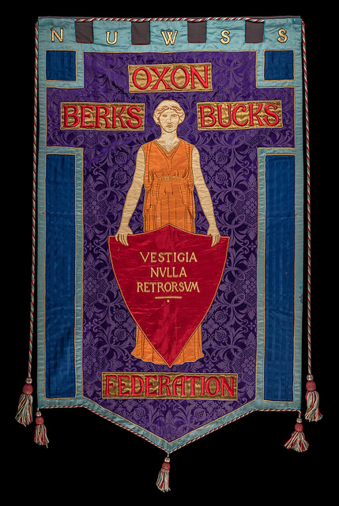
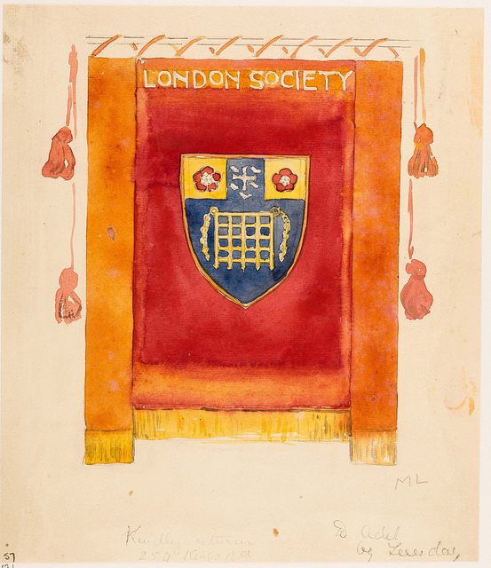
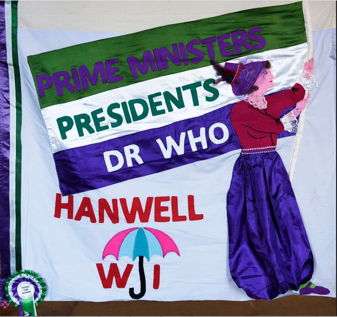
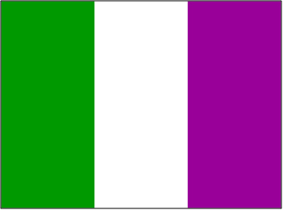

Beta version - please do not share.

Contact: Diego Alburez (<alburezg@lse.ac.uk>)

Installation
------------

    # library(devtools)
    # install_github("alburezg/suffrage")

Usage
-----

    library(suffrage)

See all available palettes:

    names(suf_palettes)

    ## [1] "flag"    "london"  "hanwell" "oxon"

Palettes
--------

### Never a Step Backward: Oxon Berks Bucks Federation

    # Discrete
    suf_palette("oxon")

### London Society (from Mary Lowndes Album)

    # Discrete
    suf_palette("london")

### Hanwell Women's Institute

    # Discrete
    suf_palette("hanwell")

### Classic suffragette flag

    # Discrete
    suf_palette("flag")

    # Continuous
    suf_palette("flag", n = 6, type = "continuous")

